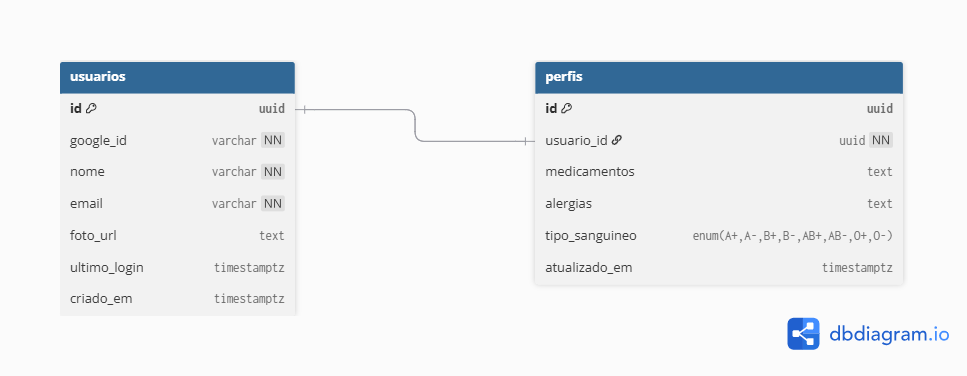

<!-- markdownlint-disable-file -->
<div align="center">
  <h1>Fredericksen API - MVP 1</h1>

  <p>
    
    
  </p>

  <div>
    
    
    
    
  </div>
</div>

<br />

## Missão do Projeto

O **Fredericksen** é um ecossistema familiar projetado sob a ótica de **Security by Design**. O objetivo deste MVP é garantir que dados sensíveis (alergias, medicamentos e tipo sanguíneo) sejam armazenados com criptografia de ponta, acessíveis apenas por identidades validadas via OAuth 2.0.

---

## Engenharia e Stack

- **Runtime:** Node.js v22 (LTS)
- **Core:** NestJS com Injeção de Dependência e Arquitetura Modular.
- **ORM:** Prisma para garantia de Type-safety no banco de dados.
- **Database:** PostgreSQL (Relacional) seguindo normalização de dados.
- **Containerização:** Docker para API e Banco de Dados, assegurando isolamento e reprodutibilidade.
- **Security:**
  - **Non-Root Execution:** Processos executados via usuário `node` (princípio do menor privilégio).
  - **At Rest:** AES-256-GCM para campos sensíveis do perfil (`medicamentos`, `alergias`). Implementado via extensão transparente do Prisma Client — a criptografia ocorre automaticamente em toda operação de escrita e leitura, sem exigir mudanças nos serviços consumidores.
  - **Autenticidade de Dados:** O modo GCM (Galois/Counter Mode) garante não apenas confidencialidade, mas também integridade: qualquer adulteração no payload criptografado é detectada e rejeitada com `InternalServerErrorException`.
  - **In Transit:** Protocolo TLS/SSL obrigatório via Cloudflare Tunnel.
  - **Auth:** Google OAuth 2.0 / OpenID Connect com tokens JWT armazenados em cookies `HttpOnly`.

> [!IMPORTANT]
> **Engineering Rules:**
>
> - **Strict Type Safety:** Uso obrigatório de `strict: true` e `noImplicitAny` no compilador.
> - **Zero `any` Policy:** Proibição total do tipo `any`, forçando tipagem explícita em toda a aplicação.
> - **Standard Casing:** Código em `camelCase` e Banco de Dados em `snake_case` via mapeamento Prisma.
> - **Domain Integrity:** Uso de `Enums` para valores restritos, garantindo validade desde o schema.
> - **Async Safety:** Tratamento obrigatório de todas as Promises para evitar `floating promises`.
> - **Imutabilidade:** Preferência por `readonly` e gestão de estado explícita.

---

## Arquitetura de Dados

<span></img><span>

---

## Variáveis de Ambiente

O projeto valida todas as variáveis de ambiente na inicialização via `class-validator`. A aplicação recusa-se a subir se qualquer variável obrigatória estiver ausente ou malformada.

| Variável                                              | Descrição                                       | Formato/Restrição                           |
| ----------------------------------------------------- | ----------------------------------------------- | ------------------------------------------- |
| `DATABASE_URL`                                        | String de conexão PostgreSQL                    | `postgresql://...`                          |
| `JWT_SECRET`                                          | Segredo de assinatura dos tokens JWT            | String não-vazia                            |
| `JWT_EXPIRES_IN`                                      | Tempo de vida do token em segundos              | Número (ex: `7200`)                         |
| `ENCRYPTION_KEY`                                      | Chave de criptografia AES-256-GCM               | Base64, exatamente 44 caracteres (32 bytes) |
| `GOOGLE_CLIENT_ID`                                    | Client ID do OAuth2 Google                      | String não-vazia                            |
| `GOOGLE_CLIENT_SECRET`                                | Client Secret do OAuth2 Google                  | String não-vazia                            |
| `GOOGLE_CALLBACK_URL`                                 | URL de callback do OAuth2                       | URL válida                                  |
| `FREDERICKSEN_WEB_URL`                                | URL do frontend (para CORS e redirecionamentos) | URL válida                                  |
| `PORT`                                                | Porta do servidor (opcional)                    | Padrão: `3000`                              |
| `POSTGRES_USER` / `POSTGRES_PASSWORD` / `POSTGRES_DB` | Credenciais do container PostgreSQL             | Usadas pelo Docker Compose                  |
| `CLOUDFLARE_TOKEN`                                    | Token do Cloudflare Tunnel                      | String do token de tunnel                   |

> [!NOTE]
> A `ENCRYPTION_KEY` deve ser gerada com exatamente 32 bytes aleatórios e codificada em Base64:
>
> ```bash
> node -e "console.log(require('crypto').randomBytes(32).toString('base64'))"
> ```
>
> O resultado terá 44 caracteres — qualquer outro comprimento é rejeitado na inicialização.

Consulte `.env.example` para um template completo.

---

## OpenAPI (Swagger)

<div align="center">
  
  
  
  
</div>

---

## Requisitos funcionais e telas do MVP1


<br />

---

## O que foi aprendido e desenvolvido neste MVP

Este projeto foi construído como estudo prático de engenharia de software, com foco em qualidade, segurança e testabilidade desde o início (Shift-Left Testing).

**Conceitos aplicados:**

- Arquitetura modular com NestJS: separação clara de responsabilidades entre controllers, services, guards, strategies e interceptors.
- Autenticação com Passport.js: fluxo completo OAuth2 com Google, extração de JWT via cookie `HttpOnly` e guard de proteção de rotas.
- Criptografia simétrica: implementação do AES-256-GCM com IV aleatório por operação e verificação de autenticidade via auth tag — evolução do CTR, que não oferecia integridade.
- Extensão transparente do Prisma Client: interceptação de queries para aplicar criptografia/descriptografia sem poluir a camada de serviço.
- Validação de ambiente: uso de `class-validator` com `plainToInstance` para garantir que a aplicação jamais suba em estado inválido.
- Testes em múltiplas camadas: unitários com mocks isolados (Jest), testes de contrato cross-repo (Vue 3 ↔ NestJS) e E2E com banco de dados real (Supertest).
- Infraestrutura como código: Terraform para regras WAF e Zero Trust Access no Cloudflare, Docker multi-stage para build reprodutível e imagem mínima em produção.
- Pipeline CI/CD: GitHub Actions com type-check, testes unitários, build Docker e deploy via runner self-hosted.

<br />

<div align="right">
  <sub>Construído com 🩷 por <b>Thaissa Leslye</b></sub><br />
  <sub>IA utilizada: Gemini no modo Flash Estendido (Geral), Claude Sonnet Low (Planejamento)</sub><br/>
</div>
